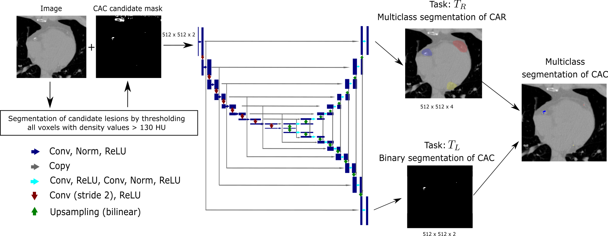
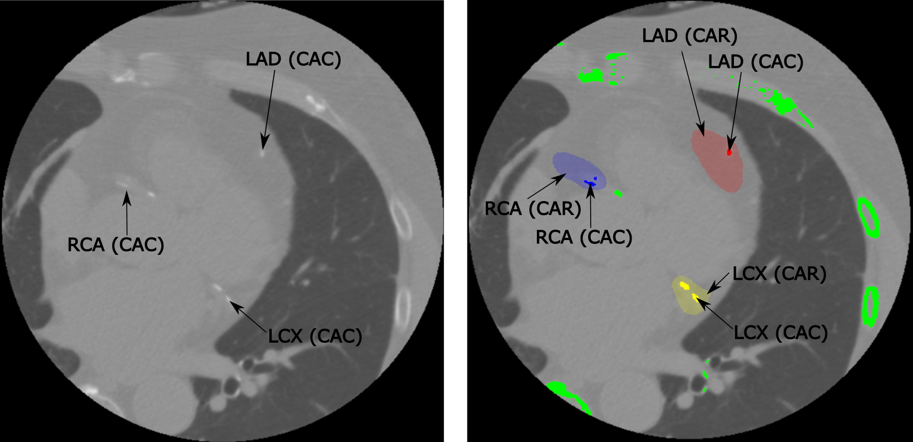

# Multi-Task Active Learning with Uncertainty Weighted Loss for Coronary Calcium Scoring

This repository is the official implementation of [Multi-Task Active Learning with Uncertainty Weighted Loss for Coronary Calcium Scoring](https://arxiv.org/abs/2030.12345). 




## Requirements

To install requirements:

```setup
pip install -r requirements.txt
```

## Prediction

To predict the model in the paper, copy  all non-contrast enhanced cardiac CT (.mhd file format) into the data folder. To run the script, you can run the cacs.sh script or run the python script in the terminal directly.

```
python cacs_predict.py -m <path_to_pretrained_model> -d <path_to_data_folder> -p <path_to_prediction_folder> -gpu cuda
```
### Example prediction


## Pre-trained Models

You can find the pretrained model in the model folder.

## Training

Since the training set and corresponding annottaions are not public, a training script is not provided. 

## Contributing

Bernhard Föllmer  
Charité - Universitätsmedizin Berlin  
Klinik für Radiologie  
Campus Charité Mitte (CCM)  
Charitéplatz 1  
10117 Berlin  
E-Mail: bernhard.foellmer@charite.de  
Tel: +49 30 450 527365  
http://www.charite.de  

